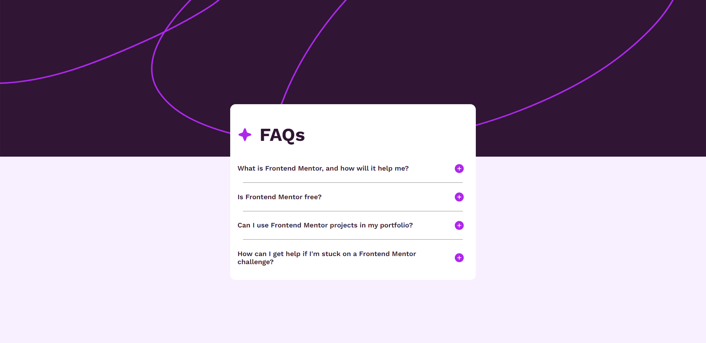
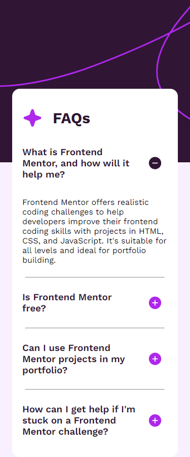

# Frontend Mentor - FAQ accordion solution

This is a solution to the [FAQ accordion challenge on Frontend Mentor](https://www.frontendmentor.io/challenges/faq-accordion-wyfFdeBwBz). Frontend Mentor challenges help you improve your coding skills by building realistic projects.

## Table of contents

- [Overview](#overview)
  - [The challenge](#the-challenge)
  - [Screenshot](#screenshot)
  - [Links](#links)
- [My process](#my-process)
  - [Built with](#built-with)
  - [What I learned](#what-i-learned)
- [Author](#author)

## Overview

### The challenge

Users should be able to:

- Hide/Show the answer to a question when the question is clicked
- Navigate the questions and hide/show answers using keyboard navigation alone
- View the optimal layout for the interface depending on their device's screen size
- See hover and focus states for all interactive elements on the page

### Screenshot

### Links

- Solution URL: https://faq-accordion-main-kutays-projects.vercel.app/
- Live Site URL: https://faq-accordion-main-kutays-projects.vercel.app/

## My process

I use HTML, CSS and JS

### Built with

- Semantic HTML5 markup
- JS
- Flexbox

### What I learned

It was a good css practice

## Author

- Frontend Mentor - [@Kutinho](https://www.frontendmentor.io/profile/Kutinho)
- Twitter - [@Kutayincirkus](https://twitter.com/Kutayincirkus)
